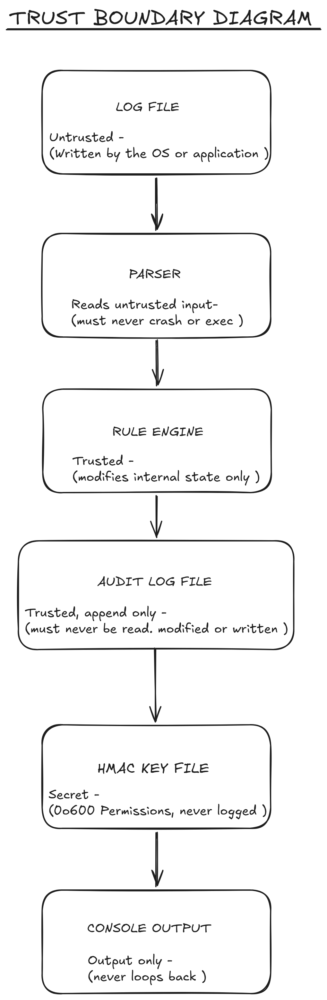

## LIDAS Architecture
   *LIDAS trusts the local file syste and the integrity of the Operating system. It also assumes the (hmac.key) is safe from users with shell access.*

**WHO CAN WRITE LOGS ?**
   *The system services or system administrator can place files on disk. LIDAS does not write the raw log files, it assumes the OS filesystem permissions already handle this. LIDAS only needs read-only access to those raw log files.*

**WHO CAN READ THE AUDIT LOG ?**
   *Anyone with filesystem read access to tthe audit log file and specifically the (cmd_verify) function in LIDAS which explicitly reads this file to check the HMAC chain. Because its a plain JSON file, any user with text editor permissions on that specific file path can read the alerts. If an attacker compromises the host machine and gains the same user privileges as LIDAS process, they can read the entire audit log history.*

**WHERE DOES THE HMAC KEY LIVE ?**
   *The HMAc key is stored in a plain file on the local filesystem, defined by the (LIDAS_KEY_PATH) environment variable. The HMAC key is a **Symmetric key** which means that the same key used to write  alerts is the same key that is used to verify them. LIDAS assumes that the host machine is secure and that only the LIDAS process and the system admin have access to the (./data/) directory.*

## Docker Distroless Setup
   For the container setup, we would decided to go with a distroless base (gcr.io/distroless/static-debian12:nonroot) and explicitly run everything as a non-root user using USER nonroot:nonroot in the Dockerfile. This would make sure that even if something goes wrong, the container itself doesn't have any admin privileges from the start.

   The distroless image is good because it strips out everything you don't need —no shell, no package managers like apt, and no system utilities. If an attacker manages to exploit the app, they basically land in an empty room with nothing useful. They can't open an interactive shell, download malware, or install packages, which really limits what they can do after breaking in.

   Running as nonroot also makes sure the application only has permissions for the files and ports it actually needs. It can't modify system binaries, write to sensitive mounted directories, or bind to privileged ports (below 1024). There is also a simple CI verification step that checks these settings—it fails the build if the container has a shell or if whoami returns root instead of nonroot
   
## Trust Boundary Diagram
  